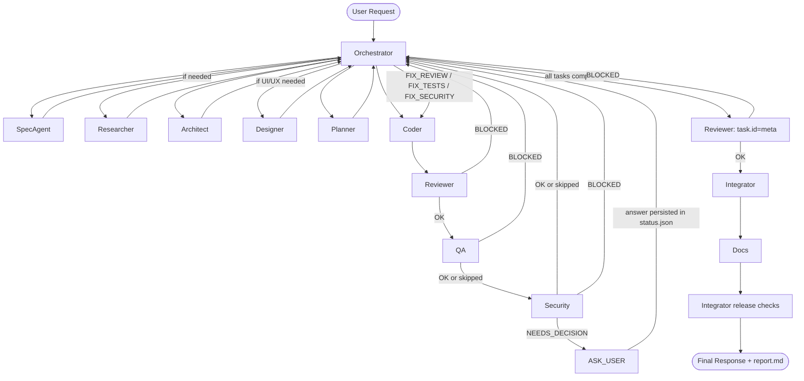

# Coordinated Agent Team

Coordinated Agent Team is a framework for autonomous software delivery with a multi-agent system. It defines clear agent roles, a deterministic workflow, strict I/O contracts, and artifact-based coordination.

## What This Repository Contains

- `.github/agents/CONTRACT.md`: global I/O contract, status model, artifact requirements, and hard gates.
- `.github/agents/WORKFLOW.md`: state machine, dispatch rules, lean mode behavior, and repair loops.
- `.github/agents/DISPATCH-REFERENCE.md`: mandatory dispatch template, context_files matrix, and pre-dispatch validation checklist used by Orchestrator.
- `.github/agents/00-orchestrator.md` to `.github/agents/11-researcher.md`: role-specific instructions for each agent.
- `.agents-work/<session>/...`: runtime artifacts generated per session.
- `demo-click-message`, `demo-greeting`, `demo-pomidoro`, and `demo-traffic-simulator`: example projects used with this workflow.

## Why Multi-Agent Delivery

A single general agent can deliver quickly, but quality can drift when responsibilities are mixed. This project separates concerns into specialized roles so each stage has explicit ownership and gates:

- specification and acceptance criteria
- architecture and planning
- implementation
- review, QA, and security
- integration and documentation

The orchestrator coordinates the process end-to-end and enforces progression rules.

## Workflow

Full workflow:

```text
INTAKE -> DESIGN -> PLAN -> IMPLEMENT_LOOP -> INTEGRATE -> RELEASE -> DONE
```

Lean workflow (for trivial, low-risk tasks):

```text
INTAKE_LEAN -> IMPLEMENT_LOOP -> INTEGRATE -> DONE
```

Additional states:

- `ASK_USER`
- `FIX_REVIEW`
- `FIX_TESTS`
- `FIX_SECURITY`
- `FIX_BUILD`
- `BLOCKED`

Workflow map (full mode, including repair loops and user decision path):



Important full-mode rule:
- After all implementation tasks are `completed`, Orchestrator runs a mandatory cross-task final review (`Reviewer` with `task.id: meta`) before `INTEGRATE`.

### Lean Mode Notes

- `SpecAgent` bootstraps minimal artifacts (`spec.md`, `acceptance.json`, `tasks.yaml`, `status.json`).
- `architecture.md` is skipped.
- `Integrator` and `Docs` are not dispatched; Orchestrator runs integration checks and creates `report.md` directly.
- If complexity expands, workflow exits lean mode and restarts from full intake.

## Agent Roster

| # | Agent | Model | Responsibility |
|---|---|---|---|
| 00 | Orchestrator | GPT-5.3-Codex | Controls state machine, dispatches work, enforces gates |
| 01 | SpecAgent | Claude Opus 4.6 | Produces `spec.md`, `acceptance.json`, and initial session artifacts |
| 02 | Architect | GPT-5.3-Codex | Designs architecture and ADRs |
| 03 | Planner | GPT-5.3-Codex | Builds `tasks.yaml` with dependencies and checks |
| 04 | Coder | Claude Opus 4.6 | Implements scoped tasks and updates task state to `implemented` |
| 05 | Reviewer | GPT-5.3-Codex | Structured code review and risk analysis |
| 06 | QA | Gemini 3 Pro (Preview) | Test planning, test execution, acceptance validation |
| 07 | Security | GPT-5.3-Codex | Security assessment and decision-trigger findings |
| 08 | Integrator | GPT-5.3-Codex | Build/CI integration and release readiness |
| 09 | Docs | Claude Haiku 4.5 | README/report updates and delivery documentation |
| 10 | Designer | Gemini 3 Pro (Preview) | UI/UX design specs |
| 11 | Researcher | Claude Opus 4.6 | Evidence-based technical research |

## Contract and Artifact Model

All session artifacts live under:

```text
.agents-work/YYYY-MM-DD_<short-slug>/
```

Core artifacts:

- `spec.md`
- `acceptance.json`
- `tasks.yaml`
- `status.json`
- `report.md`

Conditional artifacts:

- `architecture.md` (full mode)
- `adr/` (optional)
- `design-specs/` (if Designer used)
- `research/` (if Researcher used)

Task status lifecycle in `tasks.yaml`:

- `not-started`
- `in-progress`
- `implemented`
- `completed`
- `blocked`

`status.json` tracks session-level state only (`current_state`, retries, decisions, assumptions, known issues).

## Quality Gates

Workflow cannot progress when any hard gate fails:

- required artifacts are missing or invalid
- Reviewer returns `BLOCKED`
- QA returns `BLOCKED`
- Security returns `BLOCKED` for high/critical issues
- cross-task final review (`task.id: meta`) returns `BLOCKED`
- Security returns `NEEDS_DECISION` until Orchestrator resolves it through `ASK_USER`
- build/CI is red in integration or release

Repair loops have a retry budget of 3 attempts per task and loop type. After budget exhaustion, Orchestrator enters `ASK_USER`.

## Status Semantics

Global status enum:

- `OK`
- `BLOCKED`
- `FAIL`
- `NEEDS_INFO` (Researcher only)
- `NEEDS_DECISION` (Security medium-risk decisions)

`NEEDS_DECISION` is a deterministic trigger for `ASK_USER`.

## Using This Framework

### 1. Copy the agent pack into your project

Copy `.github/agents/`:

```bash
# from your project root
cp -r path/to/coordinated-agent-team/.github/agents .github/agents
```

```powershell
# from your project root
Copy-Item -Path path\to\coordinated-agent-team\.github\agents -Destination .github\agents -Recurse
```

Add runtime artifacts directory to `.gitignore`:

```gitignore
# Agent runtime artifacts
.agents-work/
```

### 2. (Alternative) Download only `.github/agents` from this repo

Use sparse checkout to fetch just the needed folder:

```bash
git clone --filter=blob:none --no-checkout <REPO_URL> coordinated-agent-team
cd coordinated-agent-team
git sparse-checkout init --cone
git sparse-checkout set .github/agents
git checkout main
```

Then copy the files into your target project.

### 3. Start in VS Code

1. Open your target project in VS Code with GitHub Copilot Chat enabled.
2. Start with Orchestrator:
   - `@orchestrator Build X with constraints Y`
3. Provide at minimum:
   - goal
   - constraints
   - `project_type` (`web|api|cli|lib|mixed`)
4. Track progress in:
   - `.agents-work/<session>/tasks.yaml`
   - `.agents-work/<session>/status.json`
5. Respond when Orchestrator enters `ASK_USER`.
6. At the end, review `.agents-work/<session>/report.md`.

## Repository Layout

```text
.github/
  agents/
    00-orchestrator.md
    01-spec-agent.md
    02-architect.md
    03-planner.md
    04-coder.md
    05-reviewer.md
    06-qa.md
    07-security.md
    08-integrator.md
    09-docs.md
    10-designer.md
    11-researcher.md
    DISPATCH-REFERENCE.md
    CONTRACT.md
    WORKFLOW.md
.agents-work/
demo-click-message/
demo-greeting/
demo-pomidoro/
demo-traffic-simulator/
README.md
```

## Demo Projects

- `demo-greeting`: lightweight greeting card demo.
- `demo-click-message`: minimal click-to-message static demo.
- `demo-pomidoro`: Pomodoro timer app with distraction journal.
- `demo-traffic-simulator`: minimal traffic simulation on Canvas.

## Maintenance Guidelines

When updating this system:

1. Keep `CONTRACT.md` as the canonical source for schema and status definitions.
2. Keep `DISPATCH-REFERENCE.md` synchronized with `00-orchestrator.md` dispatch rules and pre-dispatch gates.
3. Update `WORKFLOW.md` and role files together to avoid drift.
4. Re-check lean/full mode consistency after every rule change.
5. Preserve canonical agent names used in dispatch and `recommended_agent`.
