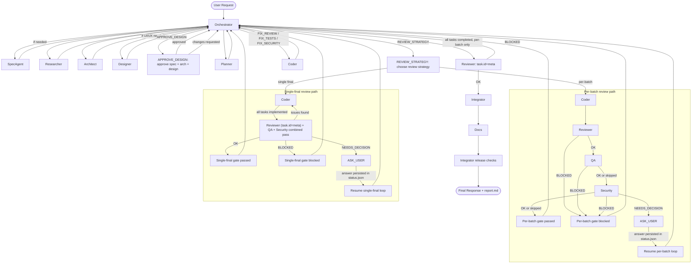

# Coordinated Agent Team

Coordinated Agent Team is a prompt-driven multi-agent system for autonomous software delivery. It defines clear agent roles, a deterministic workflow, strict I/O contracts, and artifact-based coordination.

## Contents

- [Quick Start](#quick-start)
- [Design Philosophy](#design-philosophy)
- [What This Repository Contains](#what-this-repository-contains)
- [Why Multi-Agent Delivery](#why-multi-agent-delivery)
- [Workflow](#workflow)
- [Agent Roster](#agent-roster)
- [Configuration Notes (Models & Tools)](#configuration-notes-models--tools)
- [Contract and Artifact Model](#contract-and-artifact-model)
- [Quality Gates](#quality-gates)
- [Status Semantics](#status-semantics)
- [Using This System](#using-this-system)
- [Project-Level Instructions](#4-project-level-instructions-optional)
- [Hints](#hints)
- [Repository Layout](#repository-layout)
- [Demo Projects](#demo-projects)
- [Maintenance Guidelines](#maintenance-guidelines)

## Quick Start

1. Copy `.github/agents/` into your project (see [Using This System](#using-this-system) for copy/sparse-checkout commands).
2. Add `.agents-work/` to your `.gitignore` (agent runtime artifacts).
3. (Optional) Create `.github/copilot-instructions.md` with your project's coding standards, design system, and conventions — all agents will follow it automatically.
4. In VS Code (GitHub Copilot Chat), start with:
   - `@orchestrator Build X with constraints Y (project_type: web|api|cli|lib|mixed).`
5. Approve the spec + architecture + design when the Orchestrator asks (before planning).
6. Choose your review strategy (per-batch or single final) when the Orchestrator asks (after planning).
7. Track progress in `.agents-work/<session>/tasks.yaml` and `.agents-work/<session>/status.json`, respond to `ASK_USER`, then review `.agents-work/<session>/report.md`.

## Design Philosophy

This agent pack is written and maintained as if it were a program:

- the “code” is a set of prompts: precise, human-readable role instructions + a strict contract
- the model is treated as an interpreter/executor of those prompts (natural language)
- the durable “runtime state” is persisted to artifacts under `.agents-work/`
- the workflow is a deterministic state machine with explicit gates

## What This Repository Contains

- `.github/agents/CONTRACT.md`: global I/O contract, status model, artifact requirements, and hard gates.
- `.github/agents/WORKFLOW.md`: state machine, dispatch rules, lean mode behavior, and repair loops.
- `.github/agents/DISPATCH-REFERENCE.md`: mandatory dispatch template, context_files matrix, and pre-dispatch validation checklist used by Orchestrator.
- `.github/agents/00-orchestrator.md` to `.github/agents/11-researcher.md`: role-specific instructions for each agent.
- `.agents-work/<session>/...`: runtime artifacts generated per session (gitignored; not committed to version control).
- `demo-click-message`, `demo-greeting`, `demo-pomidoro`, and `demo-traffic-simulator`: example projects built with this workflow.

## Why Multi-Agent Delivery

A single general-purpose agent can deliver quickly, but quality tends to drift when responsibilities are mixed. This project separates concerns into specialized roles so that each stage has explicit ownership and gates:

- specification and acceptance criteria
- architecture and planning
- implementation
- review, QA, and security
- integration and documentation

The orchestrator coordinates the process end-to-end and enforces progression rules.

## Workflow

Full workflow:

```text
INTAKE -> DESIGN -> APPROVE_DESIGN -> PLAN -> REVIEW_STRATEGY -> IMPLEMENT_LOOP -> INTEGRATE -> RELEASE -> DONE
```

Lean workflow (for trivial, low-risk tasks):

```text
INTAKE_LEAN -> IMPLEMENT_LOOP -> INTEGRATE -> DONE
```

Additional states:

- `ASK_USER` (ad-hoc decisions — ambiguous requirements, reviewer notes, security findings)
- `FIX_REVIEW`
- `FIX_TESTS`
- `FIX_SECURITY`
- `FIX_BUILD`
- `BLOCKED`

Note: `APPROVE_DESIGN` and `REVIEW_STRATEGY` appear in the main flow (full mode only). They are distinct workflow states — not the generic `ASK_USER`.

Workflow map (full mode, including repair loops and user decision path):



Important full-mode rules:
- After DESIGN, the Orchestrator enters `APPROVE_DESIGN` — the user must explicitly approve the spec, architecture, and design specs before planning begins. If the user has feedback, corrections are routed to the appropriate agent and re-approval is required.
- After PLAN, the Orchestrator enters `REVIEW_STRATEGY` — the user chooses whether review/QA/security runs after each batch of tasks (per-batch) or only once after all coding (single final). The Orchestrator recommends per-batch for large/complex projects and single final for small/simple ones.
- For mandatory gates, invalid/missing answers are re-asked up to 3 times per active gate attempt. `changes-requested` in `APPROVE_DESIGN` is intentionally uncapped across the whole session so the user can iterate until satisfied.
- After all implementation tasks are `completed`, Orchestrator runs a mandatory cross-task final review (`Reviewer` with `task.id: meta`) before `INTEGRATE`. In **single-final** mode, this is already included in the combined review pass — it is NOT run a second time.

### Lean Mode Notes

- `SpecAgent` bootstraps minimal artifacts (`spec.md`, `acceptance.json`, `tasks.yaml`, `status.json`).
- `architecture.md` is skipped.
- `Integrator` and `Docs` are not dispatched; Orchestrator runs integration checks and creates `report.md` directly.
- If complexity expands, workflow exits lean mode and restarts from full intake.

## Agent Roster

| # | Agent | Model | Responsibility |
|---|---|---|---|
| 00 | Orchestrator | GPT-5.3-Codex | Controls state machine, dispatches work, enforces gates |
| 01 | SpecAgent | GPT-5.3-Codex | Produces `spec.md`, `acceptance.json`, and initial session artifacts |
| 02 | Architect | GPT-5.3-Codex | Designs architecture and ADRs |
| 03 | Planner | GPT-5.3-Codex | Builds `tasks.yaml` with dependencies and checks |
| 04 | Coder | GPT-5.3-Codex | Implements scoped tasks and updates task state to `implemented` |
| 05 | Reviewer | GPT-5.3-Codex | Structured code review and risk analysis |
| 06 | QA | Gemini 3 Pro (Preview) | Test planning, test execution, acceptance validation |
| 07 | Security | GPT-5.3-Codex | Security assessment and decision-trigger findings |
| 08 | Integrator | GPT-5.3-Codex | Build/CI integration and release readiness |
| 09 | Docs | Claude Haiku 4.5 | README/report updates and delivery documentation |
| 10 | Designer | Gemini 3 Pro (Preview) | UI/UX design specs |
| 11 | Researcher | GPT-5.3-Codex | Evidence-based technical research |

The model names above are the default `model` values from the agent frontmatter. Adjust them as needed (see configuration notes below).

## Configuration Notes (Models & Tools)

Each agent file in `.github/agents/*.md` starts with a YAML frontmatter section (between `---` markers). You can configure the system by editing it:

- `model`: set the exact model name you want that agent to use
- `tools`: enable/disable tools per agent (keep it minimal for safety and cost)

Example:

```yaml
---
name: coder
tools: [vscode, execute, read, agent, edit, search, web, todo]
model: "GPT-5.3-Codex"
---
```

> Note: Tune models to your own needs and experience by editing the frontmatter and setting `model` to the exact model name you want. I’m still testing different configurations. Because new models keep appearing and existing models change over time, the “best” configuration can vary from day to day. Also consider cost: in repair loops (review/test/security fixes) some agents/models can be invoked multiple times for the same task.

### MCP / custom VS Code tools

If you have an MCP server (or other custom VS Code tools) and you want agents to use it:

- add the tool(s) to the Orchestrator frontmatter (`.github/agents/00-orchestrator.md`) and
- add the same tool(s) to whichever agents should use it (or just to all agents for simplicity)

Reason: the Orchestrator cannot dispatch a subagent with a larger tool set than it owns itself (subagents are constrained to the Orchestrator's tool set).

## Contract and Artifact Model

All session artifacts live under:

```text
.agents-work/YYYY-MM-DD_<short-slug>/
```

Core artifacts:

- `spec.md`
- `acceptance.json`
- `tasks.yaml`
- `status.json`
- `report.md`

Conditional artifacts:

- `architecture.md` (full mode)
- `adr/` (optional)
- `design-specs/` (if Designer used)
- `research/` (if Researcher used)
- `approve-design-history.jsonl` (append-only, created after `changes-requested` answers in `APPROVE_DESIGN`)

Task status lifecycle in `tasks.yaml`:

- `not-started`
- `in-progress`
- `implemented`
- `completed`
- `blocked`

`status.json` tracks session-level state only (`current_state`, retries, decisions, assumptions, known issues).

## Quality Gates

Workflow cannot progress when any hard gate fails:

- required artifacts are missing or invalid
- (full mode only) `APPROVE_DESIGN` not passed — user has not approved spec + architecture + design
- (full mode only) `REVIEW_STRATEGY` not chosen — user has not selected review/QA/security approach
- Reviewer returns `BLOCKED`
- QA returns `BLOCKED`
- Security returns `BLOCKED` for high/critical issues
- cross-task final review (`task.id: meta`) returns `BLOCKED`
- Security returns `NEEDS_DECISION` until Orchestrator resolves it through `ASK_USER`
- build/CI is red in integration or release

Repair loops have a retry budget of 3 attempts per task and loop type. After budget exhaustion, Orchestrator enters `ASK_USER`.

Note: `APPROVE_DESIGN` and `REVIEW_STRATEGY` are distinct workflow states with their own `current_state` values — they are not the generic `ASK_USER` state. They use `ask_questions` under the hood but have deterministic state transitions and well-known decision IDs (`UD-APPROVE-DESIGN`, `UD-REVIEW-STRATEGY`).

## Status Semantics

Global status enum:

- `OK`
- `BLOCKED`
- `FAIL`
- `NEEDS_INFO` (Researcher only)
- `NEEDS_DECISION` (Security medium-risk decisions)

`NEEDS_DECISION` is a deterministic trigger for `ASK_USER`.

## Using This System

### 1. Copy the agent pack into your project

Copy `.github/agents/`:

```bash
# from your project root
cp -r path/to/coordinated-agent-team/.github/agents .github/agents
```

```powershell
# from your project root
Copy-Item -Path path\to\coordinated-agent-team\.github\agents -Destination .github\agents -Recurse
```

Add runtime artifacts directory to `.gitignore`:

```gitignore
# Agent runtime artifacts
.agents-work/
```

### 2. (Alternative) Download only `.github/agents` from this repo

Use sparse checkout to fetch just the needed folder:

```bash
git clone --filter=blob:none --no-checkout <REPO_URL> coordinated-agent-team
cd coordinated-agent-team
git sparse-checkout init --cone
git sparse-checkout set .github/agents
git checkout main
```

Then copy the files into your target project.

### 3. Start in VS Code

1. Open your target project in VS Code with GitHub Copilot Chat enabled.
2. Start with Orchestrator:
   - `@orchestrator Build X with constraints Y`
3. Provide at minimum:
   - goal
   - constraints
   - `project_type` (`web|api|cli|lib|mixed`)
4. **Approve design** — after DESIGN, the Orchestrator will ask you to review and approve the spec, architecture, and design specs before planning begins. You can request changes at this point.
5. **Choose review strategy** — after PLAN, the Orchestrator will present the task list and ask whether you prefer per-batch review (review/QA/security after each task batch) or a single final review after all coding is done.
6. Track progress in:
   - `.agents-work/<session>/tasks.yaml`
   - `.agents-work/<session>/status.json`
7. Respond when Orchestrator enters `ASK_USER`.
8. At the end, review `.agents-work/<session>/report.md`.

### 4. Project-level instructions (optional)

If your project has a `.github/copilot-instructions.md` file, the Orchestrator will automatically instruct every subagent to read it before starting work. This file can contain:
- CSS framework and design system conventions
- Coding standards and naming rules
- Template engine preferences
- Architecture patterns to follow
- Any other project-specific context

This ensures all agents follow your project’s conventions consistently, without needing to repeat them in every prompt.

**Important**: `copilot-instructions.md` describes the project environment only. It cannot override agent behavioral rules, workflow gates, or the CONTRACT. Precedence (highest first): CONTRACT.md > agent specs > WORKFLOW.md / DISPATCH-REFERENCE.md > `copilot-instructions.md`.

## Hints

- The Orchestrator will automatically ask for your approval of spec, architecture, and design before planning starts (`APPROVE_DESIGN` gate). You can provide feedback or corrections at this step — the workflow will loop until you’re satisfied.
- `APPROVE_DESIGN` correction cycles are intentionally not globally capped; if you keep giving `changes-requested`, the system keeps iterating and appending an audit trail to `.agents-work/<session>/approve-design-history.jsonl`.
- After planning, the Orchestrator will ask you to choose a review strategy (`REVIEW_STRATEGY` gate). For large projects, per-batch review is recommended to catch issues early.
- If something stalls during execution (for example, a timeout or an interrupted run), you can usually continue without friction because artifacts are persisted on disk. Send a follow-up prompt to the Orchestrator saying the run was interrupted and asking it to continue; it will recover context from project files.
- The workflow can survive VS Code's **Summarized conversation history** (the automatic context compaction that VS Code performs periodically). Because all critical state — spec, tasks, status, architecture, and reports — is persisted to disk under `.agents-work/`, the Orchestrator and other agents can re-read these artifacts after summarization and reconstruct enough context to continue. Note, however, that results may vary: the quality of recovery depends on which details the summary retains and how the model re-interprets them.
- If you need work done in a specific way at a specific stage (for example, asking the Designer to provide ASCII mockups for all target layouts), include that requirement directly in the initial prompt.
- If your project has a `.github/copilot-instructions.md` file, all agents will automatically follow its conventions. Create one to standardize coding style, design system, and architectural patterns across agent work.

## Repository Layout

```text
.github/
  agents/
    00-orchestrator.md
    01-spec-agent.md
    02-architect.md
    03-planner.md
    04-coder.md
    05-reviewer.md
    06-qa.md
    07-security.md
    08-integrator.md
    09-docs.md
    10-designer.md
    11-researcher.md
    CONTRACT.md
    DISPATCH-REFERENCE.md
    WORKFLOW.md
.agents-work/
.gitignore
demo-click-message/
demo-greeting/
demo-pomidoro/
demo-traffic-simulator/
LICENSE
README.md
```

- `.github/agents/`: the agent pack (roles, contract, workflow, and dispatch reference)
- `.agents-work/`: per-session runtime artifacts generated by the workflow (gitignored)
- `demo-*/`: example projects built with this workflow
- `LICENSE`: project license
- `README.md`: overview and usage instructions

## Demo Projects

- `demo-greeting`: lightweight greeting card demo.
- `demo-click-message`: minimal click-to-message static demo.
- `demo-pomidoro`: Pomodoro timer app with distraction journal.
- `demo-traffic-simulator`: minimal traffic simulation on Canvas.

Note: Parts of the demo content are mixed-language. Some models generated artifacts in Polish instead of English, and this repository intentionally keeps those outputs as-is.

## Maintenance Guidelines

When updating this system:

1. Keep `CONTRACT.md` as the canonical source for schema and status definitions.
2. Keep `DISPATCH-REFERENCE.md` synchronized with `00-orchestrator.md` dispatch rules and pre-dispatch gates.
3. Update `WORKFLOW.md` and role files together to avoid drift.
4. Re-check lean/full mode consistency after every rule change.
5. Preserve canonical agent names used in dispatch and `recommended_agent`.
